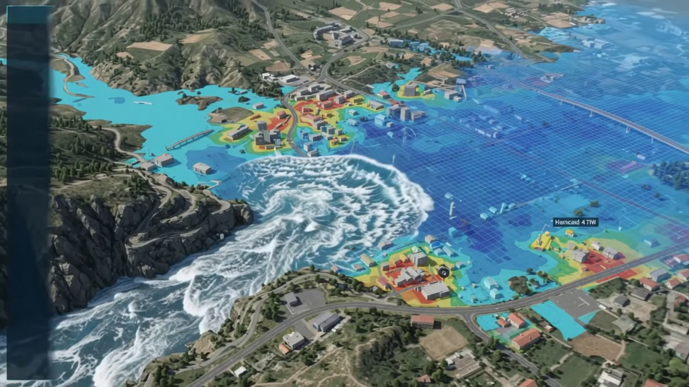
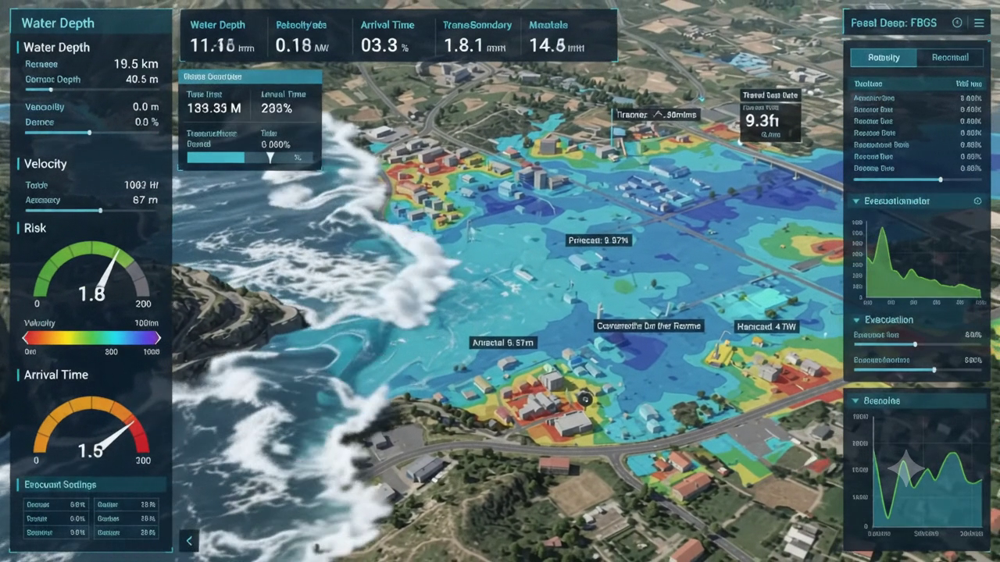

# NIYANTA — System Architecture

Current-state map of what is built. Source of truth for behavior and contracts
is [`MODULE_SPEC.md`](MODULE_SPEC.md); design narrative is
[`SYSTEM_DESIGN.md`](SYSTEM_DESIGN.md); measured numbers are in
[`BENCHMARKS.md`](BENCHMARKS.md).





## 1. Product shape

NIYANTA (SIH26161, NTRO) is a generalized dam-break inundation platform built as
**two wired-together systems** (decision D1 — canonical: [`SIH26161_ROADMAP.md`](SIH26161_ROADMAP.md) §0, `AGENTS.md`):

1. **Watch & Trigger** — fixed target areas swept daily via Google Earth Engine;
   change detection (glacier, water extent, rainfall, natural-dam blockage, seismic)
   → risk → alert → **triggers** a scenario into system 2. Always-on, real-time UX.
2. **River Context** — the analyst selects a river; its context (corridor, DEM, dams,
   population, OSM, runs) is built once, and **every other page subscribes and
   publishes to it**: Discover publishes the selection, Build publishes scenario config,
   Run/Results/Compare/Player/Evacuation publish outputs back, Watch publishes events.
   No page keeps private river state.

The three mandated use cases differ **only up to the breach**:

| Case | Use case | How it enters the pipeline |
|---|---|---|
| 1 | Natural dam / moraine breach after extreme rainfall | `scenario/builders/case1.py` |
| 2 | Reservoir overspill / operational failure | `scenario/builders/case2.py` |
| 3 | Transboundary sabotage / attack on the structure | `scenario/builders/case3.py` |

Everything downstream of the breach is shared: one `ScenarioSpec` (pydantic,
`backend/schemas/scenario.py`) → one seven-stage pipeline → one `RunResult`.
Builders only construct `ScenarioSpec` objects; stages never branch on case.

Architecture law: **spec first** — change `docs/MODULE_SPEC.md`, then code.

## 2. Runtime topology

```text
Browser (React + Vite + three.js)
   │  /api  (proxied by vite → 127.0.0.1:8000, ws:true)
   ▼
FastAPI app (backend/app.py, create_app factory)
   ├─ routers: scenarios, runs, alerts, exports, watch, risk, gee, ...
   ├─ job queue + 3 workers        (modules/jobs)   ─ started in lifespan
   ├─ daily scheduler              (gee.daily)      ─ started in lifespan
   └─ WebSocket /api/ws/runs/{id}  (lifecycle, jobs, terminal)
   ▼
PostgreSQL 16 + PostGIS  (localhost:5433, db niyanta)
   ▼
storage/  (DEMs, rasters, products, exports, gee cache)
   ▼
External engines: Delft3D FM 2026.01 (DIMR), Google Earth Engine (online),
                  SAM checkpoints (vit_h)
```

Python: `backend/config.py` fixes PROJ data dirs (`_fix_gis_env`) before any
GDAL/PROJ import — required on this machine.

## 3. Backend layout (`backend/`)

| Path | Role |
|---|---|
| `app.py` | FastAPI factory, lifespan starts/stops workers + scheduler |
| `config.py` | settings, storage paths, PROJ fix, engine root |
| `schema.sql` | all tables (no FK constraints; app owns integrity) |
| `schemas/` | `ScenarioSpec` (input) and `RunResult` (output) contracts |
| `modules/db` | psycopg2 client, uuid adapter, `seed.py` (schema + demo boxes/villages) |
| `modules/scenario` | validate/build spec, 3 case builders, sensitivity, from-risk/from-event |
| `modules/catalog` | scenario/run/product/alert CRUD + upserts |
| `modules/jobs` | queue, workers, `JobContext`, handlers for every stage |
| `modules/run` | `execute` (create+enqueue), `lifecycle` states, stage handlers, preflight |
| `modules/solvers` | `fast_swe` (numpy/torch, GPU auto ≥90k cells), `sph`, `delft3d` bridge |
| `modules/breach` | Froehlich/MacDonald/Von Thun/Zhang methods, hydrograph, level pool |
| `modules/mesh`, `proc_dem`, `proc_dam`, ... | real data stage implementations |
| `modules/gee` | Earth Engine client, products, daily refresh job |
| `modules/seg` | SAM refinement (vit_h selected), threshold baseline |
| `modules/alert` | rules, generation, ack/dispatch/close |
| `modules/export` | shp/kml/geojson/geotiff/csv/report packaging jobs |
| `modules/risk`, `connector`, `storage` | P6 risk scoring, connector sync, storage helpers |

### Pipeline (run states)

```text
DRAFT → DATA_READY → QUEUED → RUNNING → POST_PROCESSING → VALIDATED
                                                    └→ PUBLISHED
any failure → FAILED   cancel → CANCELLED
```

Stages (each a job, progress reported through `run_lifecycle` + WS):

```text
stage.terrain → stage.mesh → stage.solve → stage.post
             → stage.impact → stage.validate → stage.export
```

`stage.solve` dispatches on `spec.engine` only:
**fast** (default, 8.07 s @1 h), **delft3d** (15.07 s, mass-conservation
authority), **sph** (228.58 s, high-fidelity reference). All three grade B on
the physical validation suite — see BENCHMARKS.md §2.

### Terrain resolution order (any river works)

1. `spec.terrain_ref` → registered dataset (uploaded/ingested DEM), clipped + conditioned
2. **auto-fetch (default on):** no terrain_ref + bbox AOI → `proc_dem/copernicus.py`
   resolves the AOI's 1° Copernicus DEM-30m tiles, downloads missing ones into the
   `storage/dem` cache (atomic `.part` renames, ≤16 tiles), mosaics >1 tile, registers
   a ready `dataset(kind=dem)` row (visible in the Data tab), conditions it — grid
   source `copernicus_auto`
3. otherwise → seeded synthetic valley (`synthetic`) — offline / oversized-AOI fallback

Disable with `NIYANTA_AUTO_DEM=0` (the pytest suite and benchmark script pin it off
for hermeticity/reproducibility; `test_copernicus.py` covers the auto path against a
cached tile, and a live Kosi-basin run verified the full download→VALIDATED chain).

## 4. Frontend (`frontend/`)

| File | Role |
|---|---|
| `src/pages/MissionHub.tsx` | landing: three use-case cards → `/mission/{case}` |
| `src/pages/MissionOverview.tsx` | project list from `GET /api/scenarios`, live catalog |
| `src/pages/ProjectDashboard.tsx` | full dashboard: 3D scene, tabs, compute, alerts, exports |
| `src/lib/api.ts` | typed fetch client for the whole backend surface |
| `src/lib/wsClient.ts` | WS helpers (compute path polls `api.run` instead) |
| `vite.config.ts` | dev proxy `/api` → `127.0.0.1:8000` |
| `tests/dashboard.spec.ts` | Playwright end-to-end suite (hub → compute → export) |

Compute flow in the UI: sliders map into a fresh `ScenarioSpec` →
`POST /api/scenarios` → `POST /api/runs` → `POST /api/runs/{id}/execute` →
poll `GET /api/runs/{id}` at 1 s until terminal → load
`run.result` (max depth, arrival, villages, stations) and products.

Execute also fires the **auto-imagery** side effect (`NIYANTA_AUTO_IMAGERY=0`
disables): if no active watch box covers the scenario AOI, an `auto` box is
created, and one daily-deduped `gee.daily` sweep job is queued so Sentinel/JRC
products for that river download in the background — the run never waits on it.

3D layer (`Terrain.tsx`, `WaterSurface.tsx`, `Whitewater.tsx`,
`PostProcessing.tsx`) renders run output (swept depth grid + frame bin) and
the static demo animation (`public/flood_frames.bin`).

## 5. Static demo artifacts (legacy)

The original prototype was a static, backend-less renderer (see git history of
this file). Superseded, but kept where the UI still uses them:

| Artifact | Status |
|---|---|
| `frontend/public/flood_frames.bin` (58 MB) | served; demo flood animation XHR (errors handled) |
| `frontend/public/flood_frames.json` (240 MB) | **not fetched by any code**; intermediate of `run_real_flood.py`/`run_flood.py` that regenerates `.bin` |
| `frontend/public/simulation_data.json`, `swept_objects.json`, `frames/` | demo scene data |
| `docs/niyanta_master_architecture.md` | superseded blueprint (particle/DEM concept never built) — historical only |
| `docs/images/dashboard_ui_*.png` | UI target reference (kept, used above) |

## 6. Operations

- Start DB: `Portable_db/02_start_server.bat` (port 5433).
- Start backend: `python -m uvicorn app:create_app --factory --port 8000`
  from `backend/`. Health: `GET /api/health`.
- Start frontend: `npm run dev` from `frontend/` (5173).
- Seed demo data: `python scripts/seed_demo.py` from `backend/`
  (prunes test rows, three demo scenarios, one VALIDATED case-1 run).
- Tests: `pytest -v` from `backend/` (45 tests, ~12 min);
  `npx playwright test` from `frontend/`.
- GEE: `settings.gee_mode = "online"`, project `zeta-antenna-398715`.
